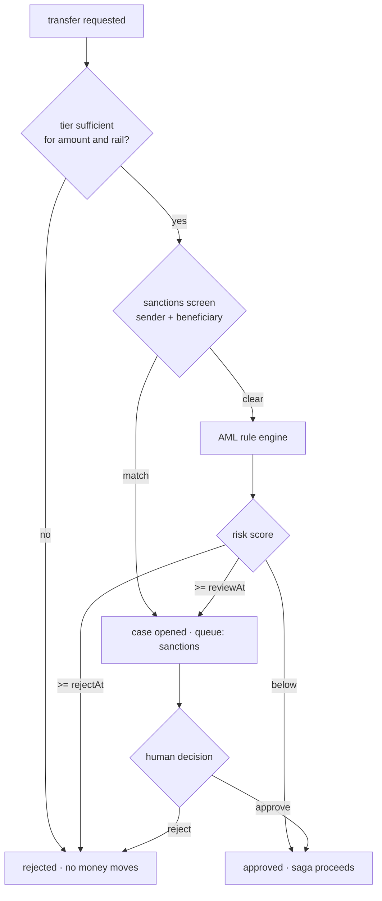

<span className="arc-eyebrow">Architecture · the core</span>

<Info>
**Phase 5, in progress.** The KYC tiering, sanctions screener, AML rule engine and review queue are implemented and tested. Wiring the real `CompliancePort` implementation into the saga — replacing the permissive `AlwaysApprove` placeholder — is the remaining work. The gate itself is already in place.
</Info>

<Warning>
**Not compliance software.** These rules and this screener illustrate how such systems are *structured*. They are not a compliance programme and must not be used as one. The sanctions list is entirely synthetic — every name is invented, no real person, entity or vessel appears, and none of the programmes correspond to any real one.
</Warning>

---

## The organising principle

<div className="arc-claim">
Compliance is a **blocking pre-condition** on money movement, not a side channel. A transfer cannot leave the gate without a recorded decision, and a rejected or flagged transfer never reaches `reserve` — so no money moves at all.
</div>

The alternative — screen asynchronously and claw back — is common and much worse. It means the failure mode is "we paid a sanctioned party and are now trying to recall it", which is a regulatory event rather than an engineering one.



---

## Tiers and limits {#tiers-and-limits}

Verification level decides what a customer may do. Four tiers, and the documents each requires:

| Tier | Requires | Per-transfer limit | Rails |
| --- | --- | --- | --- |
| 0 · unverified | — | **0** | none |
| 1 · basic | National ID | €1,000 | SEPA, mobile money |
| 2 · verified | Passport, proof of address, selfie | €15,000 | all |
| 3 · enhanced | + source of funds | unlimited | all; second approver above €100k |

Two modelling decisions worth pulling out:

<Columns cols={2}>
  <div>
    **Tier 0 is `0n`, not `null`.**

    An unverified account can hold a virtual account and *receive* funds but cannot send. Modelling that as a zero ceiling rather than a separate boolean means one code path handles it.
  </div>
  <div>
    **`null` means unlimited, and is distinct from `0n`.**

    The distinction matters enough that the limit check tests `=== null` explicitly rather than relying on falsiness — where `0n` and `null` would collapse into the same branch and invert the policy.
  </div>
</Columns>

Limits are expressed in **EUR minor units regardless of the transfer currency**; callers convert first. One reference currency avoids maintaining a limit table per corridor, and a limits regime nobody can audit is a limits regime that does not work.

### KYB and the UBO graph

Business accounts require certificate of incorporation, UBO declaration, and proof of address. Beneficial ownership is resolved as a **graph**, not a list, because ownership is genuinely recursive: a company owned by two holding companies each owned by individuals has beneficial owners nobody named on the first form.

### Maker–checker

`requiresSecondApproval` is enterprise-only. Personal accounts return `false` immediately — a consumer sending money to family should not need a second approver — and encoding that as an early return keeps the intent obvious at the call site.

---

## Sanctions screening

Exact string matching is useless against a sanctions list. Transliteration, name order, initials, and ordinary typos all defeat it, and evading it deliberately is trivial.

Arc uses **Jaro–Winkler** similarity over normalised names, checked against both primary names and aliases.

<AccordionGroup>
  <Accordion title="Why Jaro–Winkler specifically" icon="magnifying-glass">
    It weights **prefix agreement** more heavily than general edit distance, which suits personal names: people mistype and abbreviate the ends of names far more than the beginnings. "Vorlan Krestomayer" and "V. Krestomayer" score highly; two unrelated names of similar length do not.

    The default match threshold is 0.9, and the prefix weight is 0.1. Both are algorithm constants rather than amounts, which is why this file carries a scoped exception to the no-fractional-literals rule with the reasoning written above it.
  </Accordion>

  <Accordion title="False positives are the actual design problem" icon="triangle-exclamation">
    A screener tuned to catch everything flags everyone. The cost is not computational — it is a review queue that grows faster than analysts can clear it, and a team that starts approving on autopilot.

    So every match carries its score, the matched alias, the programme, and the entity type, and every hit produces an **audit trail entry** whether it is cleared or escalated. Clearing a false positive is a recorded decision by a named actor, not a silent dismissal.
  </Accordion>
</AccordionGroup>

---

## The AML rule engine

Five rule families, each returning a `RuleHit` with a severity, a score, a human-readable reason, and **evidence** — the specific prior transfers that triggered it.

<AccordionGroup>
  <Accordion title="Structuring" icon="layer-group">
    Multiple transfers deliberately kept just under a reporting threshold. Arc's default: three or more transfers within a **1,500 bp band** below the €10,000 threshold, inside a 7-day window.

    The band matters more than the threshold. Someone structuring does not send €9,999.99 — that is conspicuous. They send €8,400, €8,900, €9,100, and a rule that only catches the obvious case catches nobody.
  </Accordion>

  <Accordion title="Velocity" icon="gauge-high">
    Too many transfers, or too much total value, in a rolling 24-hour window. Defaults: more than 8 transfers, or a total above a configured EUR ceiling.

    Both conditions are needed. Count alone misses one large transfer; value alone misses a hundred small ones.
  </Accordion>

  <Accordion title="Unusual corridor" icon="route">
    A transfer along a corridor this account has never used, or has used rarely, weighted by how unusual the corridor is generally. A first DE→KE transfer from an account that has only ever sent DE→FR is not suspicious on its own — it is a signal that combines with others.
  </Accordion>

  <Accordion title="Round-tripping" icon="rotate">
    Value leaving and returning through a chain of counterparties within a window, which is the shape of layering. Detected on the graph of counterparties rather than on single transfers, because no single transfer in a round trip looks unusual.
  </Accordion>

  <Accordion title="Counterparty concentration" icon="users">
    A disproportionate share of an account's volume going to one beneficiary, over a window, above a minimum count. Defaults are expressed in basis points of total volume so the rule scales with account size rather than needing a per-tier table.
  </Accordion>
</AccordionGroup>

Every threshold lives in a single `RuleThresholds` object with documented defaults. Rules that hard-code their own numbers cannot be tuned per jurisdiction, and tuning per jurisdiction is not optional in this domain.

---

## Scoring and the three outcomes

The screener composes tier assessment, sanctions result and rule hits into a single `ComplianceVerdict`:

```ts
{ decision: 'approved' | 'rejected' | 'review',
  reasons: string[],
  riskScore: number,       // 0–100
  caseId?: string,
  sanctionsMatches?: [...],
  ruleHits?: [...] }
```

Two configurable thresholds decide the outcome: `rejectAt` blocks outright, `reviewAt` sends to a human. Everything below proceeds.

<div className="arc-claim">
The verdict carries **reasons and evidence**, not just a score. A decision a human cannot reconstruct is a decision that cannot be defended to a regulator, appealed by a customer, or debugged by an engineer.
</div>

---

## Review queues

Cases are opened into one of four queues — `kyc`, `sanctions`, `aml`, `reconciliation` — with a priority that sets an SLA:

| Priority | SLA |
| --- | --- |
| urgent | 1 hour |
| high | 4 hours |
| normal | 24 hours |
| low | 72 hours |

Priority is derived from the risk score rather than chosen by hand, so it cannot drift with whoever opened the case.

A case moves `open → assigned → awaiting_second_approval → closed`, and every transition appends an `AuditEntry` recording the actor, the action, the timestamp and an optional detail.

<div className="arc-claim">
**Four-eyes is per-queue, not global.** Sanctions decisions require two distinct approvers; a routine KYC document review does not. Applying four-eyes everywhere sounds safer and is worse — it exhausts the reviewers who need to be sharp on the decisions that actually carry risk.
</div>

The queue enforces that the second approver is a *different* actor from the first. That check is trivial to write and the single most common way maker–checker is quietly defeated in practice.

---

## How it wires into the saga

The movement context defines `CompliancePort` as an interface it owns; the risk context implements it. Movement never imports risk. The adapter lives at the composition root.

<div className="arc-gap">
`AlwaysApprove` is the current default implementation — a permissive placeholder so the saga was testable before the risk context existed. It is **not** a decision that compliance is optional. The gate is already a hard pre-condition in the saga; what remains is swapping the implementation and adding the compliance-blocked cases to the chaos suite.
</div>

<CardGroup cols={2}>
  <Card title="Next: what the tests prove" icon="flask" href="/architecture/testing">
    Property-based, mutation-checked, chaos-injected.
  </Card>
  <Card title="The regulatory picture" icon="gavel" href="/primer/regulation">
    What these controls exist to satisfy, jurisdiction by jurisdiction.
  </Card>
</CardGroup>
