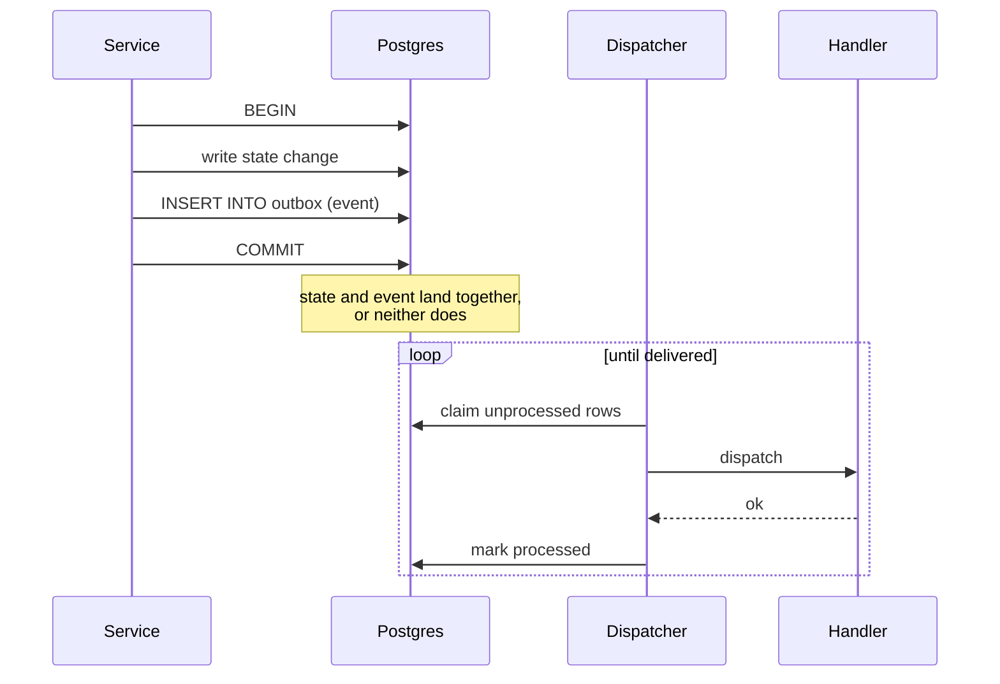

<span className="arc-eyebrow">Architecture · foundations</span>

Six bounded contexts that never import each other's code have to communicate somehow. Arc uses two mechanisms, and which one applies is decided by a single question: **can the caller wait?**

---

## Events, for everything asynchronous

The default. A context publishes a fact about something that already happened; whoever cares subscribes.

The worked example is account provisioning, and it is worth following because it is the smallest complete demonstration of the boundary holding:

<Steps>
  <Step title="Product issues a virtual account">
    A customer is onboarded and asks for a KES account. Product generates a structurally valid M-Pesa MSISDN, saves it, and publishes `virtual_account.issued`.
  </Step>
  <Step title="Ledger provisions the matching account">
    `registerLedgerProvisioning` subscribes to that event and creates the corresponding liability account, `liability.customer.va_1.KES`: with an overdraft floor of zero.
  </Step>
  <Step title="Neither context knows the other exists">
    Product does not import the ledger. The ledger does not import product. The only shared artefact is the Zod schema in `@arc/contracts`, and a test proves the wiring works end to end with no import between them.
  </Step>
</Steps>

<div className="arc-claim">
The event is the *only* thing connecting these two contexts. That is what makes them independently extractable later: replacing the in-process bus with a real broker changes the transport, not either context's code.
</div>

### The catalogue is the seam

Every event is a Zod schema in `@arc/contracts`, validated at the boundary:

```ts
export const VirtualAccountIssuedSchema = z.object({
  virtualAccountId: z.string().uuid(),
  accountId: z.string().uuid(),
  currency: z.string().min(3).max(5),
  rail: z.enum(['sepa', 'faster_payments', 'nip', 'mobile_money', 'eft', 'onchain']),
  /** IBAN, NUBAN, mobile-money handle, or chain address depending on rail. */
  identifier: z.string().min(1),
});
```

Adding a field is backwards-compatible. Removing or retyping one requires a new `version` on the envelope: the schema is a contract, and breaking it silently is how event-driven systems rot.

Note `currency` is `min(3).max(5)`, not an enum of ISO-4217 codes. `USDC` is five characters and is not a fiat currency, and a system that settles in stablecoins has to accommodate that at the type level rather than by convention.

---

## The transactional outbox

Publishing an event and changing state are two operations. If they are not atomic, there is a window in which one happens and the other does not, and that window produces the class of bug that is impossible to reproduce and impossible to argue with three weeks later.

<Columns cols={2}>
  <div>
    **Publish after commit**

    State lands, then the process dies before publishing. The ledger never provisions the account. Nothing is logged as an error, because nothing errored.
  </div>
  <div>
    **Publish before commit**

    The event fires, subscribers act on it, then the transaction rolls back. Downstream state now reflects something that never happened.
  </div>
</Columns>

The outbox resolves this by making the publish part of the same transaction:



<div className="arc-claim">
Delivery is **at-least-once**. Processing is **effectively-once**. A handler that already succeeded is never re-run on retry, and a poison event is parked for review rather than dropped or left blocking the queue.
</div>

Those three properties are the whole design, and each one is a deliberate choice against a worse alternative:

| Property | The alternative it rejects |
| --- | --- |
| At-least-once delivery | At-most-once, where a crash silently loses the event |
| Effectively-once processing | Re-running handlers on every retry, which double-posts journals |
| Poison events parked | Dropping them (silent data loss) or retrying forever (a blocked queue) |

The third is the one teams get wrong most often. A poison event that retries forever takes the queue down with it; one that is dropped takes the evidence with it. Parking it keeps the queue moving *and* keeps the event for a human to look at.

---

## Ports, for everything synchronous

Events do not work when the caller needs an answer before proceeding. The settlement saga cannot fire `funds.reservation.requested` and hope: a reservation must be accepted or rejected **before** the next step runs, or the saga has no idea what to compensate.

The answer is dependency inversion:

```ts
// services/movement/src/ports.ts — an interface movement owns
export interface LedgerPort {
  reserve(...): Promise<PostedJournal>;
  reverse(journalId: string): Promise<PostedJournal>;
}
```

Movement defines the interface. The ledger implements it. Movement never imports the ledger: it imports its own port type. The adapter that connects the two lives at the **composition root**, outside every context's `src`.

<Note>
This is why the boundary checks stay green while the call stays synchronous. Nothing crosses a context boundary in `src`; the crossing happens exactly once, in wiring code, where it is visible.

`CompliancePort` works the same way, and its default implementation, `AlwaysApprove`: is a placeholder that makes the saga testable before the risk context existed. It is explicitly *not* a decision that compliance is optional: the gate is already wired as a hard pre-condition, and Phase 5 swaps the implementation.
</Note>

---

## Enforcing the boundary

The rule is simple to state and worthless if it is only stated:

> A context may import from `packages/*` and from its own directory. Never from another context.

Two mechanisms enforce it, and the second exists because the first was found to be insufficient.

<AccordionGroup>
  <Accordion title="dependency-cruiser: catches relative imports" icon="diagram-project">
    `import { post } from '../../ledger/src/posting'` fails the build immediately. This is the obvious case, and it is the one most repositories stop at.
  </Accordion>

  <Accordion title="ESLint no-restricted-imports: catches package-name imports" icon="triangle-exclamation">
    `import { post } from '@arc/ledger'` is **not** caught by dependency-cruiser.

    The reason is mundane and worth knowing: `@arc/ledger` resolves through `node_modules` to a `dist` path which does not exist until after a build. dependency-cruiser cannot resolve it, so it skips the edge silently: no error, no warning, just a rule that quietly does not apply.

    This was discovered by writing a deliberate violation of each kind and checking that each mechanism fired. One did not. [The full breakdown →](/stories/the-boundary-that-wasnt)
  </Accordion>
</AccordionGroup>

<div className="arc-claim">
Both probes were verified to fire. An architecture rule you have not tried to break is a rule you do not know you have.
</div>

---

## What this buys

The modular monolith is a trade, and this machinery is what makes the good side of the trade real:

- **Contexts stay extractable.** Because the boundary is mechanically checked rather than merely intended, pulling `movement` into its own deployable is a wiring change, not an archaeology project.
- **The saga work is genuine.** At-least-once delivery with an outbox is the real thing, so idempotency and compensation are solving actual problems rather than simulated ones.
- **Setup stays one command.** Which, for a repository whose main job is to be read and run by strangers, is worth more than a diagram of thirty containers.

The costs are stated in [ADR 0002](/decisions/0002-modular-monolith): chiefly that there is no true network partition between contexts, so partial-availability failure modes are modelled rather than experienced.

<CardGroup cols={2}>
  <Card title="Next: the ledger" icon="scale-balanced" href="/architecture/ledger">
    The context every other context is an interface onto.
  </Card>
  <Card title="ADR 0002: modular monolith" icon="scroll" href="/decisions/0002-modular-monolith">
    The trade, argued with its alternatives.
  </Card>
</CardGroup>
