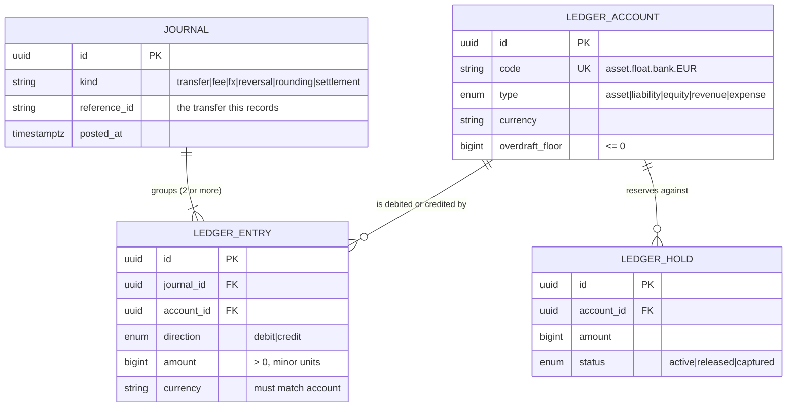
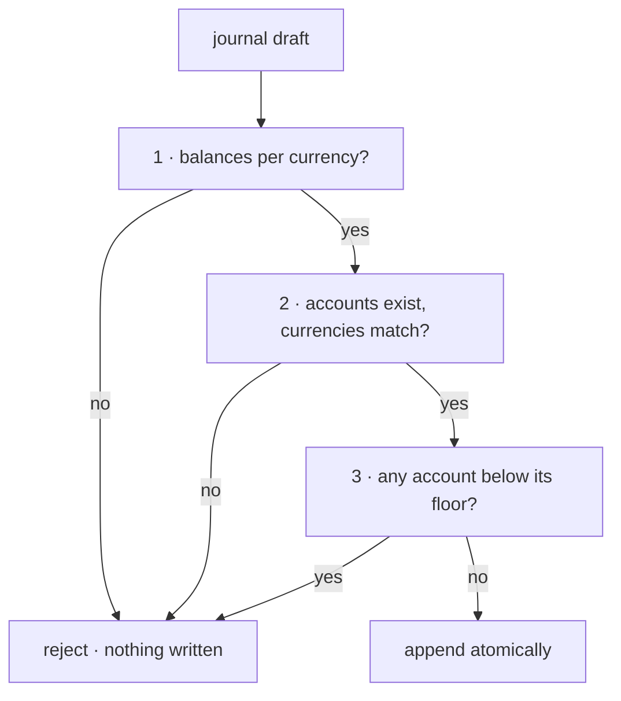
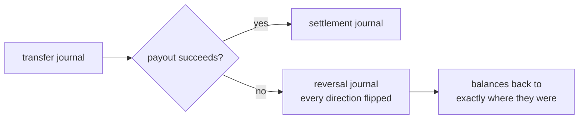

<span className="arc-eyebrow">Architecture · the core</span>

Everything else in Arc is an interface onto this. Transfers, fees, FX, reversals, reconciliation and reporting are all ways of asking the ledger a question or telling it something happened.

The ledger has one job: **record what happened to money, exactly, and never lose a unit of it.**

---

## Three ideas carry the whole design

<AccordionGroup>
  <Accordion title="A customer's balance is a liability, not an asset" icon="scale-balanced" defaultOpen>
    When someone funds a virtual account, Arc gains an asset, float sitting at a bank or on-chain, and simultaneously **owes that person the same amount**. Those are the two sides of one journal.

    Keeping them paired is what makes *"do we actually hold what we owe?"* an answerable question rather than a hope. A system that stores a customer balance as a number has no way to ask it.
  </Accordion>

  <Accordion title="Balances are derived, never stored" icon="function">
    A balance is a fold over entries. Replaying the entry log from the beginning must reproduce the same figures.

    If it does not, **the entries are right and the cached number is wrong.** That ordering is not arbitrary: it is the reason the log is the record and the balance is a projection.
  </Accordion>

  <Accordion title="Entries are append-only" icon="lock">
    A correction is a new, opposing journal. Never an edit, never a delete.

    This keeps the record of *what happened* separate from the record of *what was meant to happen*, which is the property an auditor actually cares about, and the property that makes an incident reconstructable.
  </Accordion>
</AccordionGroup>

---

## The model



Account codes are **structured strings**, not opaque ids: `asset.float.bank.EUR`, `liability.customer.va_1.KES`. A journal is therefore legible in a log or a `psql` session without joining anything, which matters at 3am far more than it matters at design time.

---

## Account types and direction

Debits increase assets and expenses. Credits increase liabilities, equity and revenue.

| Type | Increases on | Example |
| --- | --- | --- |
| `asset` | debit | `asset.float.bank.EUR`: fiat held at a partner bank |
| `liability` | credit | `liability.customer.va_1.EUR`: what Arc owes a customer |
| `equity` | credit | `equity.fx_position.EUR`: the FX bridge |
| `revenue` | credit | `revenue.fee.corridor.EUR` |
| `expense` | debit | `expense.network_fee.USDC` |

The same entry moves two accounts in opposite senses: a €10 debit *raises* a bank-float asset and *lowers* a customer liability.

That mapping lives in exactly one place, a `NORMAL_BALANCE` table, and a single function, `entrySign()`, is the only thing that reads it. Duplicating it would guarantee that the two copies eventually disagree and the ledger silently mis-signs balances. It returns `bigint` rather than `number` so it can be multiplied directly by a minor-unit amount without a cast.

### Two system accounts worth knowing

<Columns cols={2}>
  <div>
    **`liability.in_transit`**

    Funds committed to a live transfer but not yet paid out. Its overdraft floor is **zero**: driving it negative would mean paying out money nobody put in, and the posting engine rejects it.
  </div>
  <div>
    **`equity.fx_position`**

    The bridge between the currency halves of an FX journal. The *pair* of position accounts is where an unhedged exposure becomes visible: sold EUR for USDC and not covered, and it shows as offsetting balances here.
  </div>
</Columns>

---

## The central invariant

<div className="arc-claim">
In every currency it touches, a journal's debits equal its credits. **Exactly.** Not within a tolerance.
</div>

This is the reason [money is an integer count of minor units](/architecture/money). With floats an epsilon would be unavoidable here, and a ledger with an epsilon is not a ledger: "how far off is acceptable?" has no defensible answer, and the drift grows with volume.

**Per currency, independently.** A journal converting EUR to USDC has two halves and each must close on its own. Offsetting a EUR debit against a USDC credit would be adding quantities of different things: numerically possible, economically meaningless. The FX position accounts are what close each half.

`assertBalanced` checks three things in order:

<Steps>
  <Step title="At least two entries">
    One entry can never balance.
  </Step>
  <Step title="Every amount is positive and non-zero">
    `amount` is always positive; `direction` carries the sign. Allowing negative amounts would give two representations of one fact, a −€10 debit and a +€10 credit, and two representations is how ledgers drift.
  </Step>
  <Step title="Every currency balances exactly">
    Currencies are returned sorted, so error messages and test assertions are deterministic.
  </Step>
</Steps>

---

## Worked example {#worked-example}

€1,000.00 from Germany to a Kenyan mobile-money wallet. Three journals; every one balances in every currency it touches.

<Tabs>
  <Tab title="1 · The sender commits">
    `kind: transfer`

    | Account | Dr | Cr |
    | --- | --- | --- |
    | `liability.customer.va_sender.EUR` | 1000.00 | |
    | `liability.in_transit.EUR` | | 990.00 |
    | `revenue.fee.corridor.EUR` | | 5.00 |
    | `revenue.fee.fx_spread.EUR` | | 5.00 |
    | **EUR totals** | **1000.00** | **1000.00** |

    The customer's liability falls by €1,000: Arc owes them less. €990 moves into in-transit; €10 becomes revenue, split into two named fee accounts rather than one blended line.
  </Tab>

  <Tab title="2 · Convert to KES">
    `kind: fx`

    | Account | Dr | Cr |
    | --- | --- | --- |
    | `liability.in_transit.EUR` | 990.00 | |
    | `equity.fx_position.EUR` | | 990.00 |
    | `equity.fx_position.KES` | 138,401.00 | |
    | `asset.float.bank.KES` | | 138,401.00 |
    | **EUR totals** | **990.00** | **990.00** |
    | **KES totals** | **138,401.00** | **138,401.00** |

    Two currencies, two independent balances. **Neither half references the other**: this is why a conversion cannot be a single two-legged entry. The position accounts are the bridge, and the standing balance they carry *is* the open exposure.
  </Tab>

  <Tab title="3 · Pay out">
    `kind: settlement`

    | Account | Dr | Cr |
    | --- | --- | --- |
    | `asset.float.bank.KES` | 138,401.00 | |
    | `liability.customer.va_recipient.KES` | | 138,401.00 |
    | **KES totals** | **138,401.00** | **138,401.00** |

    Float down, obligation to the recipient created and immediately held as their balance.
  </Tab>
</Tabs>

**Afterwards:** the sender's balance is zero, the recipient holds KES 138,401.00, Arc kept €10.00 in revenue, and the trial balance is zero in every currency. That exact sequence is asserted by a test.

---

## Rounding residuals

A 1.5% fee on €33.33 is €0.49995, not representable in cents. Round it to €0.49 and €0.00995 has to go *somewhere*, or the journal will not balance.

| Account | Dr | Cr |
| --- | --- | --- |
| `liability.customer.va_1.EUR` | 33.33 | |
| `liability.in_transit.EUR` | | 32.83 |
| `revenue.fee.corridor.EUR` | | 0.49 |
| `revenue.rounding.EUR` | | 0.01 |

<div className="arc-claim">
The residual becomes a number someone can look at, rather than drift nobody can explain. `divResidual()` returns the exact leftover from any rounded division precisely so it can be posted like this.
</div>

[The cent that vanished →](/stories/the-cent-that-vanished)

---

## Balance-or-reject

`PostingEngine.post()` validates in full before writing anything. A rejection leaves **no trace**: there is no path that writes some entries and then discovers a problem.



The order is deliberate: cheapest and most fundamental first. Balance is pure and needs no I/O, so a malformed journal never reaches the database at all. Account resolution is one round trip. Overdraft checking needs current balances, so it is last.

### Available versus posted

```text
posted    = fold over all entries, signed by the account's normal balance
reserved  = sum of active holds
available = posted − reserved
```

A customer with €1,000 posted and a €250 active hold can spend €750. Showing them `posted` would let them spend money already committed elsewhere. A quote reserves; execution captures; expiry releases.

<div className="arc-gap">
**Holds are modelled, not yet wired.** The table and the projection exist; the saga currently debits directly rather than reserving at quote time. Wiring them belongs with the transfer API.

There is also a **known race**: between the balance read and the append, a concurrent journal could spend the same funds. In-memory and single-threaded this cannot happen, but the Prisma store must close it with `SELECT … FOR UPDATE` on the touched accounts or a serializable transaction. The database's balance trigger catches unbalanced journals: it does **not** catch a race that overdraws an account.
</div>

---

## Enforced twice, on purpose {#enforced-twice-on-purpose}

The posting engine refuses to write an unbalanced journal. The **database refuses too, independently.**

This is deliberate duplication. An invariant that depends on every future developer remembering to go through the right class is not an invariant: it is a convention, and conventions erode.

| Rule | Mechanism |
| --- | --- |
| Journals balance per currency | `CONSTRAINT TRIGGER … DEFERRABLE INITIALLY DEFERRED` |
| At least two entries per journal | same trigger |
| Amounts are positive | `CHECK (amount > 0)` |
| Entry currency matches its account | composite `FOREIGN KEY (account_id, currency)` |
| Overdraft floors are non-positive | `CHECK (overdraft_floor <= 0)` |
| Entries are append-only | `BEFORE UPDATE OR DELETE` trigger |

`DEFERRABLE INITIALLY DEFERRED` is what makes the balance check workable: it runs at `COMMIT`, not per row, so a journal can be inserted one entry at a time and is judged only once complete.

Each of these was attempted through raw SQL against a live database and rejected:

```text
ERROR:  journal aaaa…0002 does not balance in EUR: debits 100000 vs credits 99999 (difference 1)
ERROR:  journal aaaa…0003 does not balance in EUR: debits 5000 vs credits 0 (difference 5000)
ERROR:  new row violates check constraint "ledger_entry_amount_positive"
ERROR:  violates foreign key "ledger_entry_account_currency_fkey" … (account, KES) not present
ERROR:  ledger_entry is append-only: post a reversing journal instead of UPDATE on entry e000…0001
ERROR:  ledger_entry is append-only: post a reversing journal instead of DELETE on entry e000…0001
```

<div className="arc-claim">
A transaction that leaves any journal unbalanced in any currency **cannot commit**: not from the application, not from a migration script, not from a `psql` session during an incident.
</div>

---

## Reversal

Arc undoes things by posting the opposite journal, never by deleting.



Two properties make this load-bearing:

- **If a journal balances, its reversal balances.** Flipping every direction preserves the equality, so unwinding a failed transfer is safe *by construction* rather than by careful coding. That matters because the unwind path runs when something has already gone wrong.
- **It is an involution.** Reversing twice returns the original.

Both are asserted by the property suite. What the balance check *cannot* catch is compensating in the wrong order, and that is [the most instructive scenario on this site](/stories/the-journal-that-balanced-and-lied).

---

## What the tests actually prove

| Property | Assertion |
| --- | --- |
| Balance is unforgiving | Any balanced journal perturbed by **one minor unit** anywhere is rejected |
| Completeness | Any journal missing any entry is rejected |
| Solvency under load | After any random sequence of journals, the trial balance is zero in every currency |
| Rejection is total | A rejected journal changes nothing: entry count identical before and after |
| Reversal is exact | A journal and its reversal return every touched balance to precisely where it was |
| Balances are a pure fold | Recomputing from the log, in any order, gives the same answer |

These were mutation-checked. Three deliberate defects were introduced to confirm the suite is load-bearing rather than decorative:

| Mutation | Result |
| --- | --- |
| Balance validation removed from `post()` | 3 tests failed |
| Overdraft floor off by one minor unit | 1 test failed |
| `entrySign()` ignores account type | 9 tests failed |

<div className="arc-claim">
A suite that passes when the code is broken proves nothing. These do not.
</div>

[What the tests prove →](/architecture/testing)

---

## What is not here yet

<div className="arc-gap">
- **The Prisma-backed store.** The engine runs against an in-memory store; the schema, constraints and triggers are live and verified, but the adapter connecting them is not written.
- **Holds at quote time**, as described above.
- **Reconciliation and reporting**: three-way reconciliation against bank statements and on-chain history, trial balance, corridor P&L. Phase 8.
</div>

<CardGroup cols={2}>
  <Card title="Next: the chain layer" icon="link" href="/architecture/chain-layer">
    Five chains with genuinely different physics, behind one interface.
  </Card>
  <Card title="Walk a transfer" icon="route" href="/flows/consumer-remittance">
    The same €1,000, followed step by step through every context.
  </Card>
</CardGroup>
