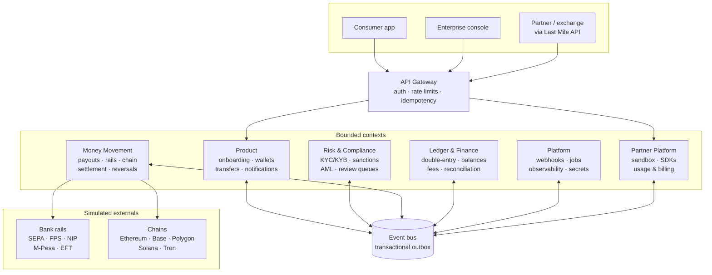
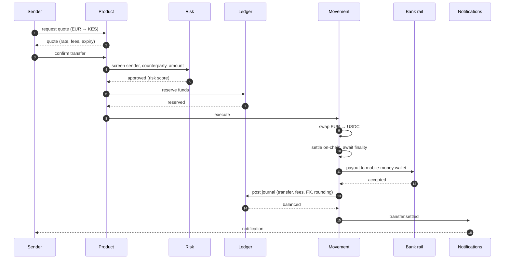

Architecture · start here

Arc runs as a **modular monolith**: one deployable, six bounded contexts that never import each other's code. It reads as microservices in the architecture diagrams and runs with one command for anyone who clones the repository.

That combination is the point. The interesting distributed-systems problems — sagas, compensating actions, at-least-once delivery, idempotency — are all present and genuinely implemented. The operational cost of running six services locally is not.

---

## The shape of the system

---

## The six contexts

| Context               | Owns                                                                                          | Status      |
| --------------------- | --------------------------------------------------------------------------------------------- | ----------- |
| **Product**           | Onboarding, account tiers, multi-currency virtual accounts, transfers, history, notifications | Built       |
| **Money Movement**    | Rail adapters, quotes, chain orchestration, the settlement saga, reversals                    | Built       |
| **Ledger & Finance**  | Double-entry posting, balances, fees, reconciliation, reporting                               | Built       |
| **Risk & Compliance** | KYC/KYB tiering, sanctions screening, AML rules, review queues                                | In progress |
| **Platform**          | Auth, gateway, webhook delivery, observability, secrets, jobs                                 | Planned     |
| **Partner Platform**  | Partner onboarding, sandbox, Last Mile API, usage and billing                                 | Planned     |

The dependency direction is the thing to hold onto: **everything is an interface onto the ledger.** Transfers, fees, FX, reversals, reconciliation and reporting are all ways of asking the ledger a question or telling it something happened. That is why it was built first, and why it is [the page to read if you only read one](/architecture/ledger).

---

## The boundary rule

  A context may import from `packages/*` and from its own directory. It may **never** import another
  context's code. A cross-context import fails the build.

This is what makes "modular monolith" a checked claim rather than a label. Two independent mechanisms enforce it, and both are needed:

<Steps>
  <Step title="dependency-cruiser catches relative imports">
    `../../ledger/src/posting` is caught immediately. This is the obvious case and the one people expect.
  </Step>
  <Step title="ESLint no-restricted-imports catches package-name imports">
    `@arc/ledger` is **not** caught by dependency-cruiser, because it resolves through `node_modules` to a `dist` path that does not exist until after a build — so the rule silently skips it.

    That gap was found by deliberately probing both mechanisms rather than by reading the configuration. It is [a story in itself](/stories/the-boundary-that-wasnt), and it is the reason both layers exist.

  </Step>
</Steps>

### How contexts actually talk

Two mechanisms, chosen by whether the caller can wait.

<Columns cols={2}>
  

    **Events — for anything asynchronous**

    Product publishes `virtual_account.issued`. The ledger subscribes and provisions the matching liability account. Neither imports the other; the only shared thing is the schema in `@arc/contracts`.

    This is the default and covers most inter-context communication.

  

  

    **Ports — for anything synchronous**

    Movement needs the ledger *now*: a reservation must be accepted or rejected before the saga proceeds, so an event round-trip will not do.

    Movement therefore defines `LedgerPort` and `CompliancePort` as interfaces **it owns**, and the other contexts implement them. The dependency is inverted; movement never imports the ledger.

  

</Columns>

The adapters wiring ports to implementations live at the composition root, outside every context's `src`, which is how the boundary stays clean while the call stays synchronous.

---

## The event bus and the outbox

Events are staged in a **transactional outbox** — written to a database table in the same transaction as the state change that produced them, then dispatched separately.

  Delivery is at-least-once; processing is effectively-once. A handler that already succeeded is
  never re-run on retry, and a poison event is parked for review rather than dropped or left
  blocking the queue.

The alternative — publish after commit — has a window in which the state change lands and the event does not, which produces exactly the silent divergence that is impossible to debug six weeks later. The outbox trades that for duplicate delivery, which is a problem you can solve with idempotency. [Contexts and events](/architecture/contexts-and-events) covers the mechanism.

---

## A transfer, end to end

Every step has a compensating action, and this is enforced rather than intended: the chaos suite fails each of the five saga steps in turn and asserts the ledger is balanced in every currency, the sender's balance is exactly what it was, and every intermediate account is back to zero.

---

## The stack, and why

| Decision  | Choice                                           | Reasoning                                                       |
| --------- | ------------------------------------------------ | --------------------------------------------------------------- |
| Language  | TypeScript on Node 22, strict                    | One language across services, SDKs and this site                |
| Topology  | Modular monolith, pnpm workspace                 | [ADR 0002](/decisions/0002-modular-monolith)                    |
| Money     | `bigint` minor units, never floats               | [ADR 0001](/decisions/0001-money-as-integer-minor-units)        |
| Datastore | Postgres 16 + Prisma                             | Ledger correctness needs real transactions and real constraints |
| Queues    | BullMQ on Redis                                  | Payout execution, settlement polling, webhook delivery          |
| Chain     | Simulated, behind a driver interface             | No external node, fully testable, deterministic in CI           |
| API       | Fastify + Zod, OpenAPI 3.1 generated from schema | One source of truth feeding docs, SDKs and the sandbox          |

---

## Where to go next

<CardGroup cols={2}>
  <Card title="Why money is never a float" icon="calculator" href="/architecture/money">
    The decision everything else rests on, and the lint rules that enforce it.
  </Card>
  <Card title="The ledger" icon="scale-balanced" href="/architecture/ledger">
    Chart of accounts, the balance rule, and a worked EUR→KES transfer entry by entry.
  </Card>
  <Card title="The settlement saga" icon="rotate-left" href="/architecture/settlement-saga">
    Five steps, five compensations, and why compensating in the wrong order produces a balanced
    ledger that lies.
  </Card>
  <Card title="What the tests prove" icon="flask" href="/architecture/testing">
    Property-based, mutation-checked, chaos-injected. The claims on this site have receipts.
  </Card>
</CardGroup>
