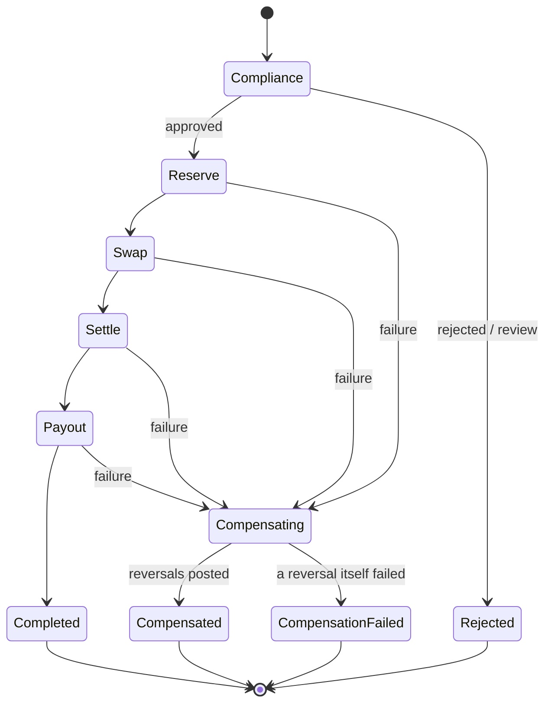

<span className="arc-eyebrow">Architecture · the core</span>

How money actually crosses the corridor: quote, screen, reserve, swap, settle on-chain, pay out — with a compensating action at every step.

The claim this page exists to justify:

<div className="arc-claim">
For every failure at every step of the saga, the ledger ends balanced in every currency and the sender is made whole.
</div>

That is asserted by the chaos suite, and the suite is mutation-checked.

---

## Why a saga and not a transaction

A database transaction gives you atomicity across things that share a transaction manager. A corridor transfer does not: it touches a ledger, a blockchain, and a foreign bank. There is no two-phase commit spanning M-Pesa and Ethereum, and there never will be.

So the saga pattern: **run steps forward, and if one fails, run compensations backward.** Not atomicity — eventual consistency with an explicit, auditable unwind.



Note the four terminal states. `compensation_failed` is the one that needs a human — and having it as a distinct outcome rather than a generic error is the difference between an operational alert and a mystery.

---

## The five steps

Each step is `{ name, execute, compensate }`, and the whole design is that these are **symmetric**: whatever `execute` posts, `compensate` reverses.

| Step | Does | Compensates by |
| --- | --- | --- |
| `compliance` | Screens sender, beneficiary, amount, corridor | Nothing — no money has moved |
| `reserve` | Debits the sender; splits out fees | Reversing journal: sender refunded in full |
| `swap` | Converts the send currency to the settlement asset | Reversing journal |
| `settle` | Broadcasts on-chain, waits for finality, posts the network fee | Reversing journal |
| `payout` | Submits to the local rail | Recalls the payout, **then** a reversing journal |

<div className="arc-claim">
**Compliance is a hard pre-condition, not a side channel.** A transfer that is rejected or flagged for review never reaches `reserve`, so no money moves at all.
</div>

`SettlementSaga.execute` runs steps in order and records completions. On any throw it compensates and **returns a result** rather than propagating — a failed transfer is a business outcome, not an exception for the caller to handle.

---

## The accounting, step by step

€1,000.00 from Germany to a Kenyan mobile-money wallet, settling via USDC on Base.

<Tabs>
  <Tab title="1 · reserve">
    Take the money and the fees.

    | Account | Dr | Cr |
    | --- | --- | --- |
    | `liability.customer.va_sender.EUR` | 1000.00 | |
    | `liability.in_transit.EUR` | | 989.09 |
    | `revenue.fee.corridor.EUR` | | 4.85 |
    | `revenue.fee.fx_spread.EUR` | | 6.06 |

    The sender's liability falls; the net moves into in-transit; the rest becomes revenue, in two separately named accounts.
  </Tab>

  <Tab title="2 · swap">
    A EUR obligation becomes a USDC asset.

    | Account | Dr | Cr |
    | --- | --- | --- |
    | `liability.in_transit.EUR` | 989.09 | |
    | `equity.fx_position.EUR` | | 989.09 |
    | `asset.float.chain.USDC` | 1072.35 | |
    | `equity.fx_position.USDC` | | 1072.35 |

    Two currencies, each balancing independently. **The EUR position account now carries a standing credit — that *is* the open FX exposure**, and it is visible rather than implicit.
  </Tab>

  <Tab title="3 · settle">
    USDC leaves, KES arrives.

    | Account | Dr | Cr |
    | --- | --- | --- |
    | `equity.fx_position.USDC` | 1072.35 | |
    | `asset.float.chain.USDC` | | 1072.35 |
    | `asset.float.bank.KES` | 138,254.00 | |
    | `liability.in_transit.KES` | | 138,254.00 |

    Plus a **separate** journal for the gas actually spent:

    | Account | Dr | Cr |
    | --- | --- | --- |
    | `expense.network_fee.ETH` | 0.000018… | |
    | `asset.float.chain.ETH` | | 0.000018… |

    Arc now holds KES float and owes KES to the beneficiary.
  </Tab>

  <Tab title="4 · payout">
    Discharge the obligation.

    | Account | Dr | Cr |
    | --- | --- | --- |
    | `liability.in_transit.KES` | 138,254.00 | |
    | `asset.float.bank.KES` | | 138,254.00 |

    Float down, obligation gone. Every currency balanced at every step.
  </Tab>
</Tabs>

---

## Why compensation is safe by construction

A compensation is the reverse of the **exact journal that step posted** — every direction flipped, same accounts, same amounts. Two properties follow:

<Columns cols={2}>
  <div>
    **If the original balanced, the reversal balances.**

    Flipping directions preserves the equality, so a compensation can never itself unbalance the ledger.
  </div>
  <div>
    **The pair nets to zero.**

    Every touched account returns to precisely where it was.
  </div>
</Columns>

This matters because the compensation path runs when something has *already* gone wrong. It must not depend on getting fresh logic right under failure — it depends only on arithmetic that was already true.

`reverseLast` pops the most recent tracked journal and posts its inverse. Because each step tracks exactly the journal it posted, and compensation runs in reverse, the pop always yields the right one.

### The network fee is deliberately not reversed

<div className="arc-claim">
Gas was really spent. Reversing it would misstate the expense, so the network-fee journal is **not tracked** and therefore never compensated. It balances on its own — Dr expense, Cr chain float, in the fee asset — so the trial balance stays zero regardless.
</div>

This is a small decision that says a lot: the ledger is required to be *balanced* and *true*, and where those pull apart, true wins.

---

## Order matters, and is asserted

Compensation walks completed steps **backwards**: payout, then settle, then swap, then reserve.

For the ledger alone, order is irrelevant — reversals commute, because addition commutes. But order is not irrelevant overall:

- The rail recall must happen **before** the settlement is unwound.
- Each reversal journal must *describe the step it actually undoes*. Compensating forward would produce a journal labelled "refund sender" that reverses the payout entries — a balanced ledger with a **false audit trail**.

<div className="arc-claim">
This gap was found by mutation testing, not by inspection. Switching to forward order kept all sixteen tests green, because balance cannot detect it. Two tests asserting reversal order and account pairing were added; the mutant now fails.

**Balance is necessary but not sufficient — an audit trail can be false while the arithmetic is true.**
</div>

[The journal that balanced and lied →](/stories/the-journal-that-balanced-and-lied)

---

## Quotes {#quotes}

```text
corridor fee   = 45bp of send + €0.35 fixed
net            = send − corridor fee − network fee
quoted rate    = mid-market − 60bp spread
receive        = net × quoted rate
fx spread fee  = (net × mid) − (net × quoted)
```

Order of operations matters, and step three is where most implementations go wrong:

<Steps>
  <Step title="Corridor fee">
    Basis points of send, plus a fixed component converted into the send currency if needed.
  </Step>
  <Step title="Network fee">
    If the caller supplied a chain estimate.
  </Step>
  <Step title="Reject if what remains is not positive">
    A €0.10 transfer cannot carry a €0.35 fixed fee. Failing **at quote time** is far better than failing mid-saga, and this check is cheap.
  </Step>
  <Step title="Convert at mid, convert at quoted, record the difference as the FX spread fee">
    The interesting one. The spread could have been left implicit in the quoted rate — the customer would see the same number.
  </Step>
</Steps>

<div className="arc-claim">
Computing the spread explicitly makes it a fee line and a ledger entry, so corridor P&L can attribute revenue between the corridor fee and the FX margin. Burying it in the rate would make the margin invisible to reporting — which is precisely the number the business runs on.
</div>

Quotes carry a 30-second TTL and `assertUsable` throws on an expired one. Rates move; honouring a stale quote is an unhedged loss. A property test asserts the customer is **never** given more than mid-market, across the full amount range. [The quote that aged →](/stories/the-quote-that-aged)

---

## Rails

Six simulated rails with genuinely different behaviour:

| Rail | Currency | Instant | Cut-off (UTC) | Notes |
| --- | --- | --- | --- | --- |
| `sepa_instant` | EUR | yes | — | €100k cap |
| `sepa_credit` | EUR | no | 15:00 | misses cut-off → next day |
| `faster_payments` | GBP | yes | — | |
| `nip` | NGN | yes | — | highest reject rate |
| `mpesa` | KES | yes | — | highest timeout rate |
| `eft` | ZAR | no | 14:00 | T+2 |

Rails are **idempotent on the caller's key**: resubmitting returns the original receipt rather than paying twice. This is the single most important property of a payout API and the easiest to get wrong. [The payout that paid twice →](/stories/the-payout-that-paid-twice)

### Retryable is a field, not a guess

<div className="arc-claim">
`RailError.retryable` is the field that matters. A **timeout** is retryable — the payout may or may not have landed, and that ambiguity is the entire reason idempotency keys exist. A **rejection** is not: retrying `account_closed` just fails again, more slowly.
</div>

`recall` returns `false` once past `settlesAt`. You cannot recall settled funds, and pretending otherwise would let the saga believe it unwound something it did not.

---

## Failure modes

### Injected, at every step

The chaos suite fails each of the five steps in turn and asserts:

- status is `compensated`
- the ledger is balanced in **every** currency
- the sender's balance is **exactly** what it was before
- every intermediate account — in-transit, corridor fee, FX spread — is back to zero

### Real, not just injected

| Failure | Behaviour |
| --- | --- |
| Chain never reaches finality | `settle` fails; swap and reserve unwind |
| Rail rejects (account closed, invalid beneficiary, compliance hold) | `payout` fails; everything unwinds |
| Rail times out | Marked **retryable**; a rejection is not |
| Sender cannot fund the transfer | `reserve` fails on the overdraft floor; nothing moves |
| Compliance rejects or flags for review | Halts before `reserve` |

---

## What is not here yet

<div className="arc-gap">
- **Holds.** The ledger models them (`available = posted − reserved`) but the saga debits directly rather than reserving at quote time.
- **Recovery beyond compensation.** If a reversal itself fails, the saga returns `compensation_failed` and stops. A real system escalates that to an operational case — Phase 8.
- **On-chain irreversibility.** Reversing `settle` is a ledger-level compensation representing funds recovered from the settlement partner, not an on-chain reversal. Nothing un-sends a confirmed transaction.
</div>

<CardGroup cols={2}>
  <Card title="Next: compliance" icon="shield" href="/architecture/compliance">
    The gate the saga cannot proceed past without a recorded decision.
  </Card>
  <Card title="Walk a reversal" icon="rotate-left" href="/flows/reversal">
    A failed payout, unwound step by step, with every compensating entry.
  </Card>
</CardGroup>
