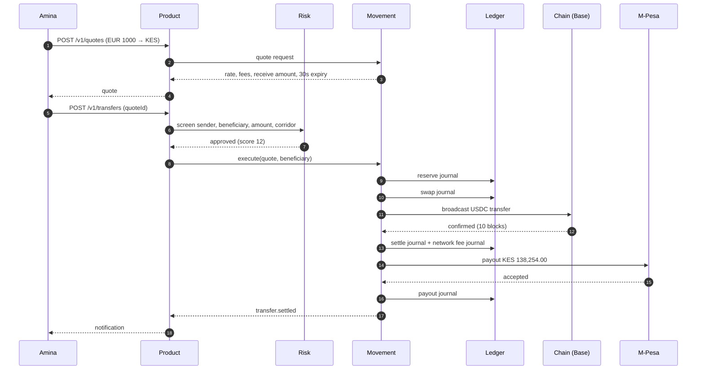

<span className="arc-eyebrow">Flow · DE → KE · EUR → KES</span>

Amina works in Munich and sends money home to Nairobi every month. Today she is sending €1,000 to her mother's M-Pesa wallet.

This page follows that transfer through every context, naming the service, the events emitted, and the exact ledger entries produced at each step. It is the same €1,000 used in [the ledger](/architecture/ledger#worked-example) and [the saga](/architecture/settlement-saga), assembled end to end.

---

## Before she starts

Amina is a **Tier 2** account: passport, proof of address and selfie verified. Her per-transfer ceiling is €15,000 and all rails are available to her. She holds a EUR virtual account with a German IBAN, funded by salary transfer.

Her mother is not an Arc customer. She is a **beneficiary**: an M-Pesa MSISDN Amina saved earlier, screened at the moment it was added and screened again on every transfer.

<Note>
Beneficiaries being screened at *use* rather than only at *creation* matters: sanctions lists change, and a beneficiary added six months ago may not be clear today.
</Note>

---

## The flow



---

## Step by step

<Steps>
  <Step title="Quote: the price, and its expiry">
    **Service:** Movement · `QuoteEngine.quote`

    ```text
    send           €1,000.00
    corridor fee   45bp + €0.35 fixed    = €4.85
    network fee    (Base estimate)       = €0.06
    net                                  = €995.09
    mid rate       EUR/KES 139.7          
    quoted rate    mid − 60bp            = 138.86
    receive        net × quoted          = KES 138,254.00
    fx spread fee  (net × mid) − receive = €6.06
    ```

    Amina sees: **send €1,000.00, receive KES 138,254.00**, with the €4.85 corridor fee and €6.06 FX margin shown as separate lines rather than folded into the rate.

    The quote expires in **30 seconds**. Rates move; honouring a stale quote is an unhedged loss, and `assertUsable` throws on an expired one. [The quote that aged →](/stories/the-quote-that-aged)
  </Step>

  <Step title="Compliance: the gate">
    **Service:** Risk · `ScreeningService.screenTransfer`

    Three checks compose into one verdict:

    - **Tier:** €1,000 is inside her €15,000 Tier 2 ceiling, and mobile money is an allowed rail. Pass.
    - **Sanctions:** sender legal name and beneficiary name screened by Jaro–Winkler against the synthetic list, including aliases. No match above threshold.
    - **AML:** five rule families evaluated against her history. Monthly €1,000 transfers to the same beneficiary on the same corridor score low on velocity, low on structuring, zero on unusual corridor. Counterparty concentration is high, she sends to one person, but below the minimum count and window thresholds.

    **Verdict:** `approved`, risk score 12, no case opened. `compliance.decided` is published with the score and an empty reasons array.

    <div className="arc-claim">
    Had this returned `rejected` or `review`, the saga would stop **here**: before `reserve`, before any money moves at all.
    </div>
  </Step>

  <Step title="Reserve: take the money and the fees">
    **Service:** Movement → Ledger · `kind: transfer`

    | Account | Dr | Cr |
    | --- | --- | --- |
    | `liability.customer.va_amina.EUR` | 1000.00 | |
    | `liability.in_transit.EUR` | | 989.09 |
    | `revenue.fee.corridor.EUR` | | 4.85 |
    | `revenue.fee.fx_spread.EUR` | | 6.06 |

    Arc now owes Amina €1,000 less. €989.09 sits in in-transit, committed but not yet paid out, and €10.91 has become revenue in two separately named accounts.

    Her balance would be rejected here if it could not fund the transfer: `reserve` fails on the overdraft floor and nothing moves.
  </Step>

  <Step title="Swap: a EUR obligation becomes a USDC asset">
    **Service:** Movement → Ledger · `kind: fx`

    | Account | Dr | Cr |
    | --- | --- | --- |
    | `liability.in_transit.EUR` | 989.09 | |
    | `equity.fx_position.EUR` | | 989.09 |
    | `asset.float.chain.USDC` | 1072.35 | |
    | `equity.fx_position.USDC` | | 1072.35 |

    Two currencies, each balancing independently. Neither half references the other: the position accounts are the bridge, and the standing balance they now carry **is** Arc's open FX exposure on this transfer.
  </Step>

  <Step title="Settle: pick a chain, broadcast, wait for finality">
    **Service:** Movement + `packages/chain`

    `selectChain` scores the available chains on settlement time and fee. With a high speed preference this picks **Base**: 2-second blocks, 10 confirmations, a ~20-second settlement window. Polygon would have been cheaper and would have taken 256 seconds. [Why →](/stories/the-fastest-chain-that-settled-last)

    <Note>
    **Why not Solana, which is faster still?** On settlement time alone it wins: ~13 seconds against Base's 20. It loses here on its drop rate, the highest in the set, because Solana transactions **expire** rather than waiting in a mempool.

    The trade inverts for a larger or more urgent transfer, and it is worth being precise about what a Solana drop actually costs. The transaction becomes permanently invalid rather than ambiguously pending, so the saga gets a definite answer and can retry cleanly with a fresh blockhash. A frequent, unambiguous failure is cheaper to handle than a rare, ambiguous one.
    </Note>

    Broadcast with an idempotency key derived from the transfer id, so a retry cannot double-send. Then, and this is the step that is easy to get wrong, the transaction is **re-read and required to be `final`**, not merely submitted without error.

    | Account | Dr | Cr |
    | --- | --- | --- |
    | `equity.fx_position.USDC` | 1072.35 | |
    | `asset.float.chain.USDC` | | 1072.35 |
    | `asset.float.bank.KES` | 138,254.00 | |
    | `liability.in_transit.KES` | | 138,254.00 |

    Plus a **separate, never-reversed** journal for the gas actually spent:

    | Account | Dr | Cr |
    | --- | --- | --- |
    | `expense.network_fee.ETH` | 0.000018… | |
    | `asset.float.chain.ETH` | | 0.000018… |

    `settlement.confirmed` is published with the chain, transaction hash, confirmation count and network fee.
  </Step>

  <Step title="Payout: discharge the obligation on the local rail">
    **Service:** Movement · `SimulatedRail` (mpesa)

    M-Pesa is an instant rail with no cut-off, and the **highest timeout rate** of the six Arc simulates. Submitted with Amina's transfer id as the idempotency key: resubmitting returns the original receipt rather than paying twice. [The payout that paid twice →](/stories/the-payout-that-paid-twice)

    | Account | Dr | Cr |
    | --- | --- | --- |
    | `liability.in_transit.KES` | 138,254.00 | |
    | `asset.float.bank.KES` | | 138,254.00 |

    Float down, obligation gone.
  </Step>

  <Step title="Notify">
    `transfer.settled` is published. The notifications service consumes it and sends Amina a confirmation. Her mother's phone shows an M-Pesa credit.

    Elapsed: roughly 25 seconds, dominated by the chain's 20-second finality window.
  </Step>
</Steps>

---

## The state afterwards

| | Before | After |
| --- | --- | --- |
| Amina's EUR balance | €1,000.00 | €0.00 |
| Beneficiary's KES | n/a | KES 138,254.00 received |
| `liability.in_transit.EUR` | 0 | 0 |
| `liability.in_transit.KES` | 0 | 0 |
| `revenue.fee.corridor.EUR` | 0 | €4.85 |
| `revenue.fee.fx_spread.EUR` | 0 | €6.06 |
| `expense.network_fee.ETH` | 0 | 0.000018 ETH |
| Trial balance, every currency | 0 | **0** |

<div className="arc-claim">
Every intermediate account is back to zero. Arc kept €10.91 in gross revenue against a real gas expense, and the trial balance is zero in EUR, KES, USDC and ETH independently.
</div>

---

## What it cost her

€10.91 on €1,000 is **1.09%**, against a World Bank average of 8.78% for this region, and that comparison is fair only up to a point. Arc's figure excludes the cost of the KES float that made instant payout possible, and the last-mile distribution economics are absorbed by M-Pesa rather than eliminated. [Why corridors cost so much](/primer/why-corridors-cost-so-much) takes that apart honestly.

---

## If something had failed

Any step after compliance failing triggers compensation, walking completed steps **backwards**:

| Failed at | Unwound |
| --- | --- |
| `reserve` | Nothing to unwind; no money moved |
| `swap` | Reserve reversed: Amina refunded €1,000.00 exactly |
| `settle` | Swap reversed, then reserve reversed |
| `payout` | Rail recall attempted, then settle, swap, reserve reversed in that order |

In every case the ledger ends balanced, Amina's balance is **exactly** €1,000.00, and every intermediate account returns to zero. That is asserted by the chaos suite at each of the five steps.

<CardGroup cols={2}>
  <Card title="Enterprise payout" icon="building" href="/flows/enterprise-payout">
    The same rails, a different surface: NGN in, SEPA Instant out, with maker–checker.
  </Card>
  <Card title="A reversal, in full" icon="rotate-left" href="/flows/reversal">
    What the table above looks like as actual compensating entries.
  </Card>
</CardGroup>
