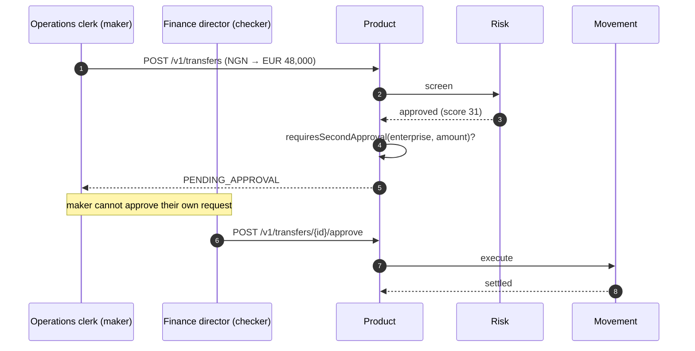

Flow · NG → DE · NGN → EUR

Kano Textiles imports machinery from a German supplier. They owe €48,000 against an invoice due Friday.

The rails are identical to [the consumer flow](/flows/consumer-remittance). What differs is **policy** — and that is the point of this page. Personal and enterprise accounts share one account model; the kind changes limits, approval requirements, and available products, not the underlying structure.

---

## What is different

| | Consumer | Enterprise |
| --- | --- | --- |
| Verification | KYC — passport, address, selfie | **KYB** — certificate of incorporation, UBO declaration, proof of address |
| Beneficial ownership | n/a | **UBO graph**, resolved recursively |
| Approval | Sender alone | **Maker–checker** above the tier threshold |
| Tier ceiling here | €15,000 (Tier 2) | Unlimited (Tier 3), second approver above €100k |
| Direction | Out of a funded balance | Fund a virtual account first, then pay |
| Out-rail | Mobile money | **SEPA Instant** — €100k cap, always open |

---

## Funding first

Kano Textiles holds a **virtual NGN account** — a real-shaped NUBAN, generated deterministically with a valid check digit, so a Nigerian bank transfer to it looks like any other bank transfer.

<Note>
The NUBAN is Nigeria's 10-digit scheme: a 3-digit bank code plus a 9-digit serial, with a weighted check digit. Arc generates structurally valid identifiers rather than placeholder strings, so a payout looks like a payout and a tampered digit fails validation. Same for IBANs, which carry real mod-97 check digits per ISO 13616.
</Note>

They transfer ₦75,000,000 from their corporate bank account via NIP. Arc's rail adapter receives it and the ledger posts:

| Account | Dr | Cr |
| --- | --- | --- |
| `asset.float.bank.NGN` | 75,000,000.00 | |
| `liability.customer.va_kano.NGN` | | 75,000,000.00 |

Both sides of the funding. Arc gains an asset — naira sitting at a partner bank — and simultaneously owes Kano Textiles the same amount. Pairing them is what makes "do we hold what we owe in NGN?" answerable.

---

## The approval flow

**The maker cannot be the checker.** The queue enforces that the second approver is a distinct actor from the first — a check that is trivial to write and the single most common way maker–checker is quietly defeated in practice.

`requiresSecondApproval` returns `false` immediately for personal accounts. A consumer sending money to family should not need a second approver, and encoding that as an early return keeps the intent obvious at the call site rather than buried in a policy table.

---

## Compliance, at enterprise scale

The same three checks, weighted differently.

<AccordionGroup>
  <Accordion title="KYB and the UBO graph" icon="sitemap">
    Ownership is resolved as a **graph**, not a list. Kano Textiles is owned by two holding companies, one of which is owned by three individuals. The beneficial owners are those individuals — none of whom appear on the first form anyone filled in.

    Every resolved UBO is screened against the sanctions list, not just the operating company. An entity screening clean while its ultimate owner does not is exactly the case the graph exists to catch.
  </Accordion>

  <Accordion title="AML rules on a business pattern" icon="chart-line">
    Enterprise flows look nothing like consumer flows, and the rules score accordingly. Large, infrequent, invoice-shaped payments to a small set of established suppliers are **normal** here and would be alarming from a personal account.

    What raises the score to 31: NG→DE is a corridor this account uses only a few times a year, and €48,000 is well above its median. Neither is close to `reviewAt`. What would trip it: a sudden series of transfers to a **new** beneficiary, or counterparty concentration shifting sharply within a window.
  </Accordion>

  <Accordion title="Tier 3 and source of funds" icon="file-invoice">
    Kano Textiles is Tier 3 — unlimited per-transfer ceiling, with a second approver required above €100,000. Reaching Tier 3 required a source-of-funds document on top of the Tier 2 set.

    This transfer is below €100,000, so the second approver here is required by **enterprise policy**, not by the tier threshold. Both paths exist and they compose.
  </Accordion>
</AccordionGroup>

---

## The journals

Same five steps, mirrored direction. Abbreviated to the shape, since [the consumer flow](/flows/consumer-remittance) walks each in full.

<Tabs>
  <Tab title="reserve">
    | Account | Dr | Cr |
    | --- | --- | --- |
    | `liability.customer.va_kano.NGN` | 74,120,000.00 | |
    | `liability.in_transit.NGN` | | 73,780,460.00 |
    | `revenue.fee.corridor.NGN` | | 118,540.00 |
    | `revenue.fee.fx_spread.NGN` | | 221,000.00 |
  </Tab>

  <Tab title="swap">
    | Account | Dr | Cr |
    | --- | --- | --- |
    | `liability.in_transit.NGN` | 73,780,460.00 | |
    | `equity.fx_position.NGN` | | 73,780,460.00 |
    | `asset.float.chain.USDC` | 52,180.00 | |
    | `equity.fx_position.USDC` | | 52,180.00 |
  </Tab>

  <Tab title="settle">
    | Account | Dr | Cr |
    | --- | --- | --- |
    | `equity.fx_position.USDC` | 52,180.00 | |
    | `asset.float.chain.USDC` | | 52,180.00 |
    | `asset.float.bank.EUR` | 48,000.00 | |
    | `liability.in_transit.EUR` | | 48,000.00 |
  </Tab>

  <Tab title="payout">
    | Account | Dr | Cr |
    | --- | --- | --- |
    | `liability.in_transit.EUR` | 48,000.00 | |
    | `asset.float.bank.EUR` | | 48,000.00 |

    Out via **SEPA Instant** to the supplier's IBAN. Instant, always open, €100,000 cap — this transfer fits comfortably.
  </Tab>
</Tabs>

---

## The rail decision that would have cost a day

SEPA offers Arc two out-rails for EUR, and picking the wrong one has an asymmetric cost.

| Rail | Instant | Cut-off | If submitted at 16:00 UTC |
| --- | --- | --- | --- |
| `sepa_instant` | yes | — | Arrives in seconds |
| `sepa_credit` | no | 15:00 | Queues to **tomorrow's** opening, then takes its normal latency |

Missing a batch rail's cut-off by an hour costs a **day**, not an hour — the queued payment starts from the next opening *and then* takes the rail's normal latency. That compounding is asserted by a test that checks the exact arithmetic, not assumed.

For an invoice due Friday submitted Thursday afternoon, that distinction is the whole product. [The cut-off that cost a day →](/stories/the-cutoff-that-cost-a-day)

---

## Where the money ended up

| | After |
| --- | --- |
| Kano Textiles NGN balance | ₦880,000.00 remaining |
| Supplier | €48,000.00 received via SEPA Instant |
| Arc revenue | ₦339,540.00 across two fee accounts |
| Every in-transit account | 0 |
| Trial balance, every currency | **0** |

Total cost to Kano Textiles: roughly **0.46%** of the invoice — materially cheaper than the consumer rate, because the fixed component is amortised over a much larger amount and the corridor fee is basis-point based. That asymmetry is real and is why enterprise and consumer are different products over one set of rails.

<CardGroup cols={2}>
  <Card title="A reversal, in full" icon="rotate-left" href="/flows/reversal">
    What happens when the supplier's IBAN is closed and the payout is rejected.
  </Card>
  <Card title="Risk and compliance" icon="shield" href="/architecture/compliance">
    KYB, the UBO graph, and the four-eyes queue in detail.
  </Card>
</CardGroup>
