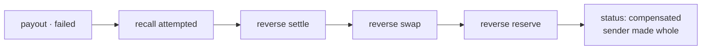

<span className="arc-eyebrow">Flow · failure and unwind</span>

Everything went right until the last step. The chain settled, Arc holds KES float, and the beneficiary's M-Pesa number turns out to be deregistered.

The rail rejects. Now the interesting part.

<div className="arc-claim">
Arc undoes things by posting the opposite journal, never by deleting. The sender ends with **exactly** the balance they started with — not approximately, and not after a manual adjustment.
</div>

This is the same €1,000 transfer from [the consumer flow](/flows/consumer-remittance), failed at `payout`.

---

## What has already happened

Four journals are posted, three of them tracked for compensation.

| # | Step | Journal | Tracked? |
| --- | --- | --- | --- |
| 1 | `reserve` | Sender debited, fees split out | yes |
| 2 | `swap` | EUR obligation → USDC asset | yes |
| 3 | `settle` | USDC out, KES float in | yes |
| 3b | `settle` | Network fee: Dr expense, Cr chain float | **no** |
| 4 | `payout` | — rejected before posting | n/a |

<div className="arc-claim">
The network-fee journal is deliberately **not tracked** and therefore never reversed. Gas was really spent. Reversing it would produce a balanced ledger that misstates the expense — and where "balanced" and "true" pull apart, true wins.

It balances on its own, so the trial balance stays zero regardless.
</div>

---

## The rail says no

```text
RailError {
  code: 'account_closed',
  retryable: false,
  message: 'beneficiary MSISDN is deregistered'
}
```

`retryable: false` is the field that decides everything next.

<Columns cols={2}>
  <div>
    **A timeout would be retryable.**

    The payout may or may not have landed — and that ambiguity is the entire reason idempotency keys exist. Resubmit with the same key; the rail returns the original receipt if it already processed it.
  </div>
  <div>
    **A rejection is not.**

    Retrying `account_closed` just fails again, more slowly. The saga stops trying and starts unwinding.
  </div>
</Columns>

---

## Compensation, backwards



The saga walks **completed** steps in reverse. `payout` never completed, so there is no payout journal to reverse — but the rail recall is still attempted, because the saga cannot assume the submission left no trace.

<Note>
`recall` returns `false` once past `settlesAt`. You cannot recall settled funds, and pretending otherwise would let the saga believe it unwound something it did not. Here the payout was rejected outright, so there is nothing at the rail to recall.
</Note>

### 1 · Reverse `settle`

Every direction flipped, same accounts, same amounts.

| Account | Dr | Cr |
| --- | --- | --- |
| `asset.float.chain.USDC` | 1072.35 | |
| `equity.fx_position.USDC` | | 1072.35 |
| `liability.in_transit.KES` | 138,254.00 | |
| `asset.float.bank.KES` | | 138,254.00 |

<div className="arc-gap">
**This is a ledger-level compensation, not an on-chain reversal.** It represents funds recovered from the settlement partner. Nothing un-sends a confirmed on-chain transaction — that limitation is real and is stated rather than papered over.
</div>

### 2 · Reverse `swap`

| Account | Dr | Cr |
| --- | --- | --- |
| `equity.fx_position.EUR` | 989.09 | |
| `liability.in_transit.EUR` | | 989.09 |
| `equity.fx_position.USDC` | 1072.35 | |
| `asset.float.chain.USDC` | | 1072.35 |

Both FX position accounts return to zero. The open exposure this transfer created is closed.

### 3 · Reverse `reserve`

| Account | Dr | Cr |
| --- | --- | --- |
| `liability.in_transit.EUR` | 989.09 | |
| `revenue.fee.corridor.EUR` | 4.85 | |
| `revenue.fee.fx_spread.EUR` | 6.06 | |
| `liability.customer.va_amina.EUR` | | 1000.00 |

**The fees are reversed too.** Amina is refunded €1,000.00 — the full amount, not the amount net of fees. Arc absorbs the cost of a failed transfer, which is both the correct commercial answer and the only one that keeps the arithmetic clean.

---

## Why this is safe by construction

<Columns cols={2}>
  <div>
    **If the original balanced, the reversal balances.**

    Flipping every direction preserves the equality. A compensation can never itself unbalance the ledger — not because someone wrote it carefully, but because the arithmetic makes it impossible.
  </div>
  <div>
    **The pair nets to zero.**

    Every touched account returns to precisely where it was. `reverseEntries` is also an **involution**: reversing twice returns the original.
  </div>
</Columns>

This matters because the compensation path runs when something has *already* gone wrong. It must not depend on getting fresh logic right under failure.

---

## Why the order matters

For the ledger alone, order is irrelevant — reversals commute, because addition commutes. Run them forwards and the balances come out identical.

Order is not irrelevant overall:

<Steps>
  <Step title="The rail recall must precede the settlement unwind">
    Unwinding the settlement while a payout might still be in flight at the rail risks recovering funds you are simultaneously paying out.
  </Step>
  <Step title="Each reversal journal must describe the step it actually undoes">
    Compensating forward would produce a journal labelled "refund sender" that reverses the *payout* entries. Balanced ledger, **false audit trail**.
  </Step>
</Steps>

<div className="arc-claim">
Switching to forward order kept all sixteen tests green, because balance cannot detect it. Two tests asserting reversal order and account pairing were added; the mutant now fails.

**Balance is necessary but not sufficient — an audit trail can be false while the arithmetic is true.** [The full story →](/stories/the-journal-that-balanced-and-lied)
</div>

---

## The final state

| | Before the transfer | After the unwind |
| --- | --- | --- |
| Amina's EUR balance | €1,000.00 | **€1,000.00** |
| `liability.in_transit.EUR` | 0 | 0 |
| `liability.in_transit.KES` | 0 | 0 |
| `equity.fx_position.EUR` | 0 | 0 |
| `equity.fx_position.USDC` | 0 | 0 |
| `revenue.fee.corridor.EUR` | 0 | 0 |
| `revenue.fee.fx_spread.EUR` | 0 | 0 |
| `expense.network_fee.ETH` | 0 | **0.000018 ETH** |
| Trial balance, every currency | 0 | **0** |

Everything is back to zero except the gas, which was genuinely spent and stays on the books as an expense Arc absorbed.

`SagaResult.status` is `compensated`. Amina gets a notification explaining the beneficiary number is invalid, and the entry log contains the full sequence — what was attempted, what succeeded, and exactly how each part was undone.

---

## When compensation itself fails

The fourth terminal state exists for a reason.

<div className="arc-gap">
If a reversal itself throws, the saga returns `compensation_failed` and **stops** rather than retrying blindly into a partially-unwound state. That status is distinct from `compensated` precisely so it can be alerted on.

A real system escalates this to an operational case with the completed and failed compensation steps attached. That case management is Phase 8, and until it exists this is a known gap rather than a solved problem.
</div>

<CardGroup cols={2}>
  <Card title="The settlement saga" icon="rotate-left" href="/architecture/settlement-saga">
    The mechanism this page exercises, step by step.
  </Card>
  <Card title="What the tests prove" icon="flask" href="/architecture/testing">
    The chaos suite runs this unwind at every one of the five steps.
  </Card>
</CardGroup>
