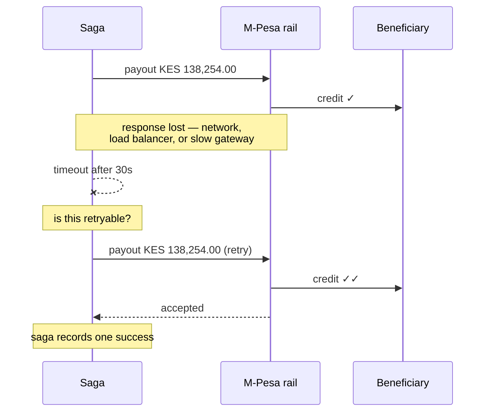

<span className="arc-eyebrow arc-eyebrow--amber">Story · distributed failure · 5 min</span>

<div className="arc-symptom">
A beneficiary in Nairobi received KES 138,254.00 twice, four seconds apart, for a transfer the sender made once. The ledger shows one transfer and one payout. The rail's statement shows two. Nothing in the logs looks like an error — the retry that caused it is logged at `info`, because it worked.
</div>

---

## The sequence



The timeout is the whole problem. **A timeout is not a failure.** It is the absence of information about whether something succeeded.

<div className="arc-claim">
The saga has exactly two options after a timeout and both are wrong without more machinery: retry and risk paying twice, or give up and risk stranding funds the rail already sent. There is no third option that is safe by reasoning alone.
</div>

---

## Why the obvious fixes fail

<AccordionGroup>
  <Accordion title="Do not retry timeouts" icon="ban">
    Now a network blip strands a transfer in an unknown state. Someone has to reconcile it by hand against the rail's statement, and until they do, the customer's money is neither sent nor refunded.

    This converts a rare double-payment into a common manual-intervention case. Worse trade.
  </Accordion>

  <Accordion title="Query the rail before retrying" icon="magnifying-glass">
    Better instinct, and still broken. The query has the same problem as the payout: it can time out. And there is a window between the query returning "not found" and the retry landing, in which the original could arrive.

    You have made the race narrower, not eliminated it. Narrower races are harder to reproduce and just as expensive.
  </Accordion>

  <Accordion title="Deduplicate on amount and beneficiary" icon="equals">
    Then a customer who genuinely sends their sister KES 138,254.00 twice in one day has their second transfer silently swallowed.

    Deduplicating on data rather than on **identity of intent** always breaks on legitimate repetition.
  </Accordion>
</AccordionGroup>

---

## The actual fix: the caller supplies identity

The retry is not a new instruction. It is *the same instruction, sent again* — and the only party who knows that is the caller.

So the caller says so, with an **idempotency key** derived from the transfer id:

```ts
await rail.submit({
  idempotencyKey: `payout:${transferId}`,
  amount, beneficiary,
});
```

<div className="arc-claim">
Resubmitting with the same key returns **the original receipt** rather than paying twice. The rail, not the saga, becomes responsible for recognising a repeat — because the rail is the only party that knows whether it already acted.
</div>

This is the single most important property of a payout API and the easiest to get wrong. It has to hold at every layer that can retry:

| Layer | Key derived from | Guarantees |
| --- | --- | --- |
| Public API | Client-supplied `Idempotency-Key` header | The same transfer request cannot create two transfers |
| Rail adapter | Transfer id | The same payout cannot be submitted twice |
| Chain broadcast | Transfer id | Rebroadcast returns the original hash rather than a second transaction |
| Event handlers | Event id | A redelivered event is not processed twice |

Arc's chain simulator implements this deliberately — `broadcast` is idempotent by key, matching real client behaviour and matching Arc's own retry semantics. A retry that produced a second on-chain transaction would be a duplicate payment with no recall path at all.

---

## Retryable is a field, not a guess

The second half of the fix is knowing **when** to retry, and this is where most implementations reach for a heuristic on the error message.

Arc puts it in the type:

```ts
class RailError extends Error {
  readonly code: string;
  readonly retryable: boolean;
}
```

<Columns cols={2}>
  <div>
    **Timeout → `retryable: true`**

    The payout may or may not have landed. That ambiguity is the entire reason idempotency keys exist. Retry with the same key; the rail resolves it.
  </div>
  <div>
    **Rejection → `retryable: false`**

    `account_closed`, `invalid_beneficiary`, `compliance_hold`. Retrying just fails again, more slowly, while the customer waits. Unwind instead.
  </div>
</Columns>

<div className="arc-claim">
Making retryability a field on the error rather than a decision at the call site means the rail adapter — the only component that understands the rail's semantics — decides, once, in one place.
</div>

M-Pesa has the highest timeout rate of the six rails Arc simulates. NIP has the highest rejection rate. Those are different failure profiles that demand different handling, and a system treating all rail errors as "error" handles both badly.

---

## The related trap: recall

When a transfer must unwind after a successful payout, the saga attempts a **recall**. This has its own honesty requirement:

```ts
recall(receipt): boolean  // false once past settlesAt
```

<div className="arc-claim">
You cannot recall settled funds. `recall` returns `false` once past `settlesAt`, and the saga must handle that rather than assuming success — because pretending otherwise would let it believe it unwound something it did not.
</div>

A system that assumes recall always works produces a ledger showing money returned that is, in reality, sitting in a stranger's mobile-money wallet in Nairobi.

---

## The lesson

<Steps>
  <Step title="A timeout is missing information, not a failure">
    Design for "I do not know" as a first-class outcome. Every distributed system has this state and most codebases model it as an exception, which is exactly the modelling that loses the information.
  </Step>
  <Step title="Idempotency is the caller's responsibility to declare, the receiver's to honour">
    Only the caller knows two requests are the same intent. Only the receiver knows whether it already acted. The key is how that knowledge crosses the boundary.
  </Step>
  <Step title="Deduplicate on identity of intent, never on data">
    Amount plus beneficiary plus timestamp is a heuristic that breaks on legitimate repetition. A key derived from the transfer id is a fact.
  </Step>
  <Step title="Encode retryability in the type system">
    A field on the error, set by the component that understands the semantics. Not a regex on the message at the call site.
  </Step>
</Steps>

<CardGroup cols={2}>
  <Card title="The settlement saga" icon="rotate-left" href="/architecture/settlement-saga">
    Rails, idempotency, and the `retryable` field in context.
  </Card>
  <Card title="The cut-off that cost a day" icon="clock" href="/stories/the-cutoff-that-cost-a-day">
    Next: a payout that was not late by an hour, but by a day.
  </Card>
</CardGroup>
